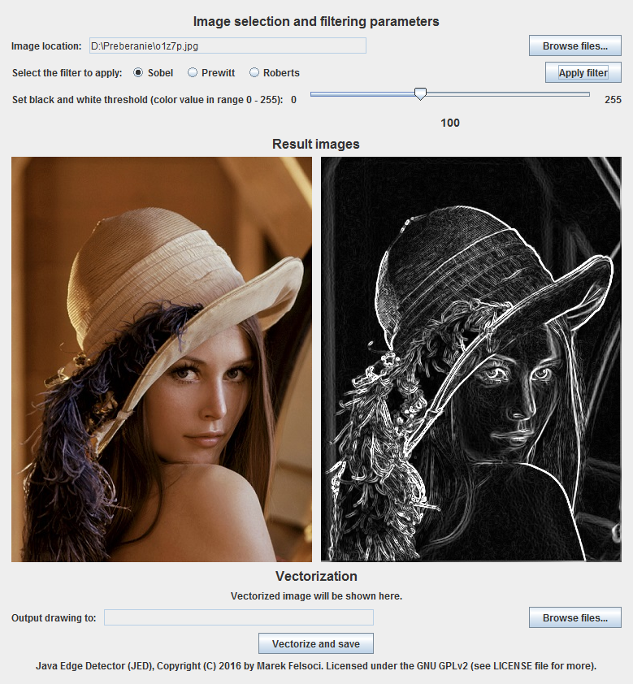

# JED: Java Edge Detector

Image edge detection and simple vectorization program using convolution filters

## About

As assignment for our Object-oriented programming classes at the University of Strasbourg, we created a image contour detection program which uses convolution filters such as *Sobel*, *Roberts* or *Prewitt*. The program was extended to perform a naive vectorization of the input image. It can be then written down to a Scalable Vector Graphics (SVG) file.

## Vectorization algorithm

The vectorization strategy used is very straightforward. Starting with a thresholded black and white image we iterate over and try to detect segments by inspecting neighbor pixels in three directions (right, diagonal right, down and diagonal left). Finally, the resulting set of detected segments allows to redraw the original image in a vectorized form.

## Usage

As the program is written in Java, it can be used on any machine running a Java virtual machine.

Plus, the user interface is pretty straightforward to understand: import a source image, select the filter to apply, set desired threshold value, select output SVG file and perform vectorization.

## Screenshot

## Author

[Marek Felsoci](mailto:marek.felsoci@etu.unistra.fr), student at the [University of Strasbourg](http://www.unistra.fr).

## License

Java Edge Detector and its source code are licensed under the terms of the GNU General Public License, version 2. See the [LICENSE](LICENSE) file for full license text.

## Image credits

The "Lena" image was acquired from [i.stack.imgur.com/o1z7p.jpg](https://i.stack.imgur.com/o1z7p.jpg).
